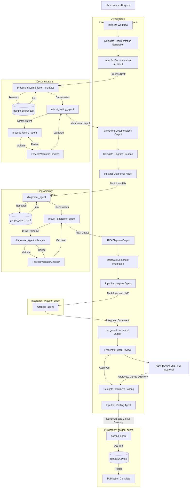

---

---
## Original Documentation

## Project/Process Overview
This multi-agent system is designed to streamline the creation of workflow diagrams from user descriptions, automating the process from documentation generation to visual representation and final publication. The system leverages a central orchestrator to delegate tasks to specialized sub-agents, ensuring efficiency, accuracy, and compliance with documentation standards. This approach aims to reduce manual effort and accelerate the delivery of clear, structured workflow documentation.

---

## Structure and Key Components
The system operates on a hierarchical multi-agent architecture, with a primary orchestrator managing a team of specialized sub-agents.

### Specialized Roles and Units

*   **interactive_process_creator_agent (Orchestrator)**:
    *   **Core Function:** Serves as the central orchestrator, receiving user requests, delegating tasks to specialized sub-agents, and managing the overall workflow from initiation to completion.
    *   **Responsibilities:** Interprets user requests for workflow diagrams, assigns documentation and diagramming tasks, coordinates the merging of outputs, facilitates user review, and initiates the publication process.
    *   **Decision Points:** Decides which sub-agents to activate, when to proceed to the next stage of the workflow, and when to request user feedback.

*   **process_documentation_architect**:
    *   **Core Function:** Responsible for transforming a user's short process description into a structured Markdown workflow document.
    *   **Responsibilities:** Analyzes process requirements, drafts the textual description of the workflow, and ensures the documentation is clear, accurate, and compliant.
    *   **Decision Points:** Determines the structure and content of the Markdown, and relies on its sub-agents for robust writing and validation.
    *   **Sub-agents:**
        *   **robust_writing_agent:** Focuses on generating well-structured and clear process descriptions.
            *   **process_writing_agent:** Drafts the initial Markdown content.
        *   **ProcessValidatorChecker (Loop agent):** Reviews and validates the drafted Markdown against the initial requirements and best practices, iterating until the document is robust and accurate.

*   **diagramer_agent**:
    *   **Core Function:** Converts the Markdown workflow description into a visual flowchart (PNG image).
    *   **Responsibilities:** Generates visual representations of the process, ensuring the diagram accurately reflects the documented steps and components.
    *   **Decision Points:** Decides on the layout and visual elements of the flowchart, and relies on its sub-agents for robust diagramming and validation.
    *   **Sub-agents:**
        *   **robust_diagramer_agent:** Focuses on creating high-quality, readable diagrams.
            *   **diagramer_agent:** Renders the flowchart image.
        *   **ProcessValidatorChecker (Loop agent):** Validates that the generated flowchart accurately matches the Markdown description, ensuring consistency between text and visual representation.

*   **wrapper_agent**:
    *   **Core Function:** Merges the generated Markdown documentation and the PNG flowchart into a single, cohesive output document.
    *   **Responsibilities:** Combines the textual and visual elements into a final presentation format, ready for user review.

*   **posting_agent**:
    *   **Core Function:** Handles the publication of the approved workflow document to the specified GitHub directory.
    *   **Responsibilities:** Interfaces with GitHub to commit and push the final documentation.

### Essential Tools and Resources

*   **google_search tool**: Utilized by both `process_documentation_architect` and `diagramer_agent` for researching specialized terms, technical standards, and best practices to enhance documentation and diagram accuracy.
*   **github MCP tool**: Employed by the `posting_agent` to interact with GitHub's platform for repository management and automated workflow execution, enabling direct publication of the final document.
*   **Markdown files**: Intermediate and final output format for textual documentation.
*   **PNG images**: Output format for graphical workflow diagrams.

---

## Workflow

1.  **Request Initiation**: The user sends a request to the `interactive_process_creator_agent` with a brief description outlining the desired workflow diagram's structure and goals.
2.  **Documentation Creation**: The `interactive_process_creator_agent` delegates the task to the `process_documentation_architect`. This agent, using its `robust_writing_agent` and `ProcessValidatorChecker`, drafts a detailed Markdown file describing the workflow. `google_search` may be used for research during this step.
3.  **Diagram Generation**: Concurrently, or upon completion of the Markdown, the `interactive_process_creator_agent` delegates to the `diagramer_agent`. This agent, using its `robust_diagramer_agent` and `ProcessValidatorChecker`, generates a PNG flowchart based on the Markdown description. `google_search` may be used for research to ensure accurate visual representation.
4.  **Final Document Assembly**: The `interactive_process_creator_agent` then engages the `wrapper_agent` to combine the validated Markdown description and the generated PNG diagram into a single, comprehensive document.
5.  **User Review & Approval**: The `interactive_process_creator_agent` presents the complete document to the user, gathering feedback and requesting the target GitHub directory for publication.
6.  **Publication to GitHub**: Upon user approval, the `interactive_process_creator_agent` activates the `posting_agent`, which uses the `github MCP` tool to publish the final document to the designated GitHub repository.

---

## Value Statement
This multi-agent system significantly enhances the efficiency and quality of workflow documentation. By automating the generation of both textual and visual representations and integrating validation loops, it ensures accuracy and consistency. The system reduces manual effort, accelerates the documentation process, and provides a standardized, compliant output, ultimately fostering clearer communication and better understanding of organizational or system processes. Future improvements could include expanding the types of diagram formats supported or integrating with other version control systems.